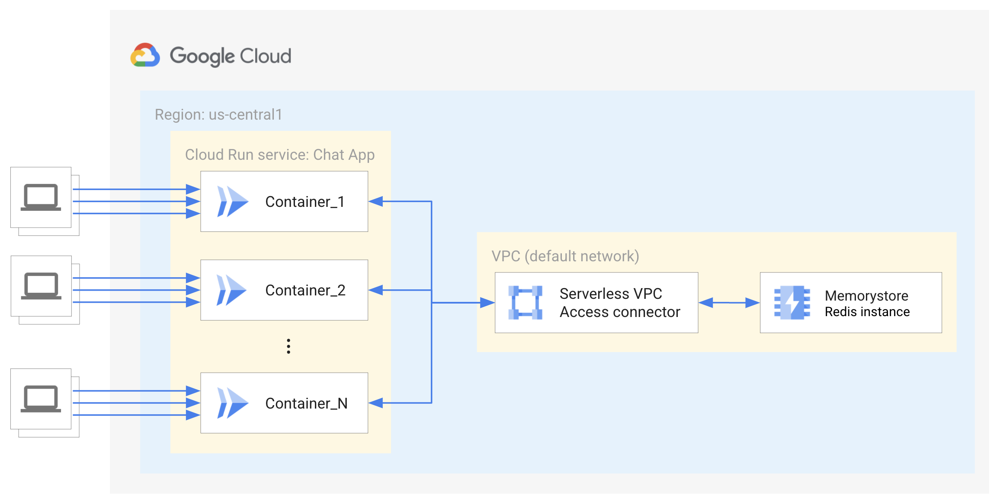

# Crystal WebSockets demo sample for Cloud Run
### kemal-redis-chat

This sample demonstrates how to use [WebSockets](https://en.wikipedia.org/wiki/WebSocket)
on [Cloud Run][run] with [Crystal](https://crystal-lang.org/). 
The demo is a web app, that supports a single chat room.
Crystal is a compiled language, that has a syntax similar to Ruby.
It is known to be very fast (as fast as Go), and the binaries are very small.
The web server is known as [Kemal](https://kemalcr.com/), and supports
WebSockets out of the box.

In order to have a consistent chat message queue, even when there are
numerous web servers due to auto-scaling, we must use a database for
persistence.  We use [Redis](https://redis.com/), since it is fast and
simple to set-up.



- [Crystal Websockets sample for Cloud Run](#kemal-redis-chat)
  - [Setup](#setup)
  - [Running locally](#running-locally)
  - [Deploying to Cloud Run](#deploying-to-cloud-run)
  - [Deploying via Cloud Run button](#deploying-via-cloud-run-button)

## Setup

Before you can run or deploy the sample, you need to do the following:

1. Refer to the [run/README.md][readme] file for instructions on
    running and deploying.
2. Install `crystal` and its dependency manager `shards`
3. Install dependencies:

    With `shards`:

        shards install

## Running locally

With `crystal`:

    crystal run src/kemal-redis-chat.cr

> [!NOTE]
> Unless you have a local redis DB running, the program will crash.

## Deploying to Cloud Run

1. Create a [Redis instance on Cloud Memorystore.](https://cloud.google.com/memorystore/docs/redis/creating-managing-instances) Make sure to choose the VPC network you will use (default). After it’s created, note its IP address.

    ```bash
    gcloud redis instances create redis-chat --size=1 --region=us-central1 \
    --connect-mode=PRIVATE_SERVICE_ACCESS
    ```
    
2. Deploy to Cloud Run, with Direct VPC egress:

    ```bash
    export REGION=us-central1
    export REDISHOST=$(gcloud redis instances describe redis-chat --region REGION --format "value(host)")

    gcloud beta run deploy websockets \
    --source . \
    --allow-unauthenticated \
    --region $REGION \
    --max-instances 10 \
    --concurrency 100 \
    --timeout 3600 \
    --network=default \
    --subnet=default \
    --vpc-egress=private-ranges-only \
    --set-env-vars REDIS=$REDISHOST \
    --set-env-vars DEBUG="false"
    ```
    
## Deploying via Cloud Run button
Click on the below button to:
1. Launch a Cloud Shell machine
2. Download this GitHub repository
3. Build a container using Docker
4. Push the container into Google Container Regsitry
5. Launch Cloud Run

All automatically...
> [!IMPORTANT]
> Since this code requires a redis DB, and the appropriate
> ENV variable set, it will *not* work directly via the Cloud Run button.
> However, it should be easy to re-deploy a new revision with the
> proper ENV variables and network settings.

[](https://deploy.cloud.run)


## Describe Cloud Run service

```bash
    gcloud beta run services describe websockets \
    --region=us-central1
```

## Clean up

``` bash
    gcloud run services delete websockets
```

---

## Development
I added a Makefile to simply building and deploying
the executable. I also created a Docker compose file for local testing.

### Available make commands
``` bash
$ make
Available targets:

  build/cloud                         Build docker container in Cloud
  build/docker                        Build docker container locally
  build/local                         Compiles source using shards command
  clean/cloud                         Delete Cloud Run service and container
  deploy                              Deploy container to Cloud Run
  docker/login                        Configures Docker to authenticate to GCR
  help                                This help screen
  logs                                Examine the logs from the Cloud container
  logs/stream                         Stream Cloud Run logs
  watch                               Locally run program with dynamic recompile
```

## Resources
### Cloud Run
1. https://github.com/GoogleCloudPlatform/cloud-run-button

### GNU Make
1. [GNU make](https://www.gnu.org/software/make/manual/make.html)
2. [The Art of Makefiles](https://levelup.gitconnected.com/the-art-of-makefiles-a-technical-guide-to-automated-building-6bb43fefe1ed)
3. [Makefile Best Practices](https://docs.cloudposse.com/reference/best-practices/make-best-practices/)
4. [Learn Makefiles](https://makefiletutorial.com/)

## Notes
Send authorization token, if unauthenticated is not allowed
``` bash
curl --header "Authorization: Bearer $(gcloud auth print-identity-token)" [URL]
```

It is now possible to send requests via a local proxy, even if the service is authenticated.

``` bash
    gcloud beta run services proxy
```

## Running Redis locally
docker network create -d bridge redisnet
docker run -d -p 6379:6379 --name myredis --network redisnet redis

# Appendix
- https://cloud.google.com/run/docs/tutorials/websockets
- https://github.com/GoogleCloudPlatform/nodejs-docs-samples/tree/main/run/websockets
- https://serdardogruyol.com/building-a-realtime-chat-app-with-crystal-and-kemal
- https://www.tlbx.app/blog/dispatch-kemal-websocket-messages-with-redis-pub-sub
- https://kemalcr.com/
- https://crystal-lang.org/
